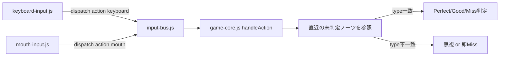

# リズムゲーム チーム開発アーキテクチャ設計書

2026-09-21

## 1. 現状のコード調査

現在の実装は `index.html` / `style.css` / `game.js` の3ファイルのみのフロントエンド完結構成で、**曲のBPMやノーツを手動設定する仕組みは一切なく、すべて音声波形から自動生成**されている。

### 自動ビート検出の仕組み(`detectBeats()`)

1. `AudioContext.decodeAudioData()` でmp3をデコードし、全チャンネルを平均してmono配列にする
2. 1024サンプル単位の窓(ウィンドウ)ごとにエネルギー(振幅の二乗和)を計算する
3. 直近1秒分の窓のエネルギー移動平均を求め、その **1.4倍を超えた窓をビート(ノーツ)として検出**する
4. ビート同士が近すぎないよう最小間隔0.3秒を設ける

BPMという概念は使わず、曲ごとに波形の山(ドラムやキックなど)を直接検出している。結果は「曲の先頭からの相対秒」の配列 `beatOffsets` になる。

### 再生とタイミング同期

- `playGame()` が mp3 を `fetch` → `decodeAudioData` → (未計算なら)`detectBeats()` を実行
- `AudioContext.currentTime` を基準に `startTime` を決め、`beatOffsets` を絶対時刻の配列 `beatTimes` に変換
- `AudioBufferSourceNode` で実際の音声を再生開始

時間の基準を常に `audioCtx.currentTime` に統一しているため、一時停止(`audioCtx.suspend()`)しても時間がずれない。

### ゲームループとノーツ表示

- `requestAnimationFrame` による `tick()` が毎フレーム実行され、次を行う
  - `checkMissedBeats()`: 判定ウィンドウ(Perfect ±0.08秒 / Good ±0.18秒)を過ぎた未入力ビートをMiss扱いにする
  - `updateNotes()`: `NOTE_LEAD_SEC`(1.1秒)先までのビートをノーツ要素として生成し、ヒットラインまでの位置を毎フレーム計算して表示する
  - ビート到達ごとにキャラクターをバウンスさせる

### 入力とスコア判定

- `keydown` で Space キーを検出し `handleSpace()` を呼ぶ
- 直近の未判定ビートとの時間差を見て Perfect / Good / Miss を判定し、スコア・コンボ・キャラクターの発光・ノーツの消去を行う

### 状態管理

`state` 変数1つで `idle → loading → playing ⇄ paused → ended` を管理し、ボタンの表示/非表示もこの値から一元的に決めている(`setControlsForState()`)。

### 現状の課題(今回の再設計理由)

曲のURL・キャラクターの絵文字・背景色・判定ウィンドウなどの数値が、すべて `game.js` / `index.html` / `style.css` に直接埋め込まれている。「ステージ」という概念がまだ存在しないため、複数人が同時に複数ステージを作ると同じファイルを取り合ってコンフリクトする。

## 2. 「ステージ」の定義

**ステージとは「曲・見た目・難易度の設定値」をまとめたデータの固まりであり、ノーツやBPMは一切含まない**。ノーツは従来通り `detectBeats()` が実行時に自動生成する。

### StageConfig の形(JSオブジェクト、ビルド不要)

```js
// stages/stage1.js
export default {
  id: "stage1",
  title: "Shining Star",
  audioUrl: "assets/songs/stage1.mp3",
  background: { type: "image", value: "assets/bg/back_dra.png" }, // 単色にする場合は { type: "color", value: "#16213e" }
  character: {
    type: "sprite",
    offsetX: -62.1, // キャラ画像レイヤーを横にずらす量(ステージ幅の%)。キャラをヒットラインの位置に合わせる
    frames: {
      normal: "assets/chars/dra_normal.png",   // 通常(normalとnormal2を交互に表示して動かす)
      normal2: "assets/chars/dra_normal2.png",
      perfect: "assets/chars/dra_perfect.png", // Perfect / Good 判定時
      miss: "assets/chars/dra_miss.png",       // Miss 判定時
    },
  },
  difficulty: {
    perfectWindow: 0.08,   // 秒
    goodWindow: 0.18,      // 秒
    noteLeadSec: 1.1,      // ノーツが見え始めてから到達までの秒数
    minBeatGapSec: 0.3,    // 検出ビートの最小間隔(早すぎる曲への微調整用)
    energyThreshold: 1.4,  // 移動平均の何倍でビートとするか(早すぎ/遅すぎを調整)
  },
  specialNotes: {
    mouthNoteEvery: 8, // 検出されたビートのうち N拍ごとに1回を口ノーツに変換(0なら無効)
  },
};
```

### 含めてよいもの / 含めてはいけないもの

| 分類 | 具体例 | 理由 |
| --- | --- | --- |
| 含めてよい(静的データ) | 曲ファイルのパス、背景、キャラ画像、タイトル | ステージごとに変わる見た目情報 |
| 含めてよい(検出パラメータ) | `perfectWindow` `goodWindow` `noteLeadSec` `minBeatGapSec` `energyThreshold` | 曲のテンポや難易度に合わせたチューニング値。省略時は現在のデフォルト値を使用 |
| 含めてよい(ルール) | `specialNotes.mouthNoteEvery` | 「N拍ごとに口ノーツ化」というルールのみ。どのビートが口ノーツかは実行時に機械的に決まる |
| **含めてはいけない** | ノーツの時刻リスト、BPM値、手動の譜面データ | 「自動生成を保持」という前提に直接違反する。必ず `detectBeats(audioBuffer)` を実行時に呼んで毎回生成する |

つまりステージデータは「素材とチューニング値の定義」だけで、「リズムそのもの」は一切含まない。

## 3. 同一ゲームシステムで複数ステージをロードする方法

`game.js` を「コア(ゲームエンジン)」と「ステージ設定」に分割し、ビルドツールなしの ES Modules (`<script type="module">`) だけで実現する。フロントエンド完結のまま、Netlify/GitHub Pagesへのデプロイ方法も変わらない。

### ファイル構成(提案)

```text
rhythm-game/
  index.html
  style.css
  core/
    game-core.js      # 現在の game.js の中身(ロジック本体)。initGame(stageConfig) を export
    beat-detector.js  # detectBeats() を切り出して分離(既存ロジックは無変更)
    input/
      keyboard-input.js
      mouth-input.js
  stages/
    stage1.js
    stage2.js
    stage3.js
    index.js          # 全ステージを一覧化するレジストリ
  assets/
    songs/
    chars/
    bg/
```

### 起動フロー

```mermaid
flowchart LR
  A[index.html] --> B[stages/index.jsでステージ一覧を取得]
  B --> C[URLの?stage=stage2や選択画面でstageIdを決定]
  C --> D[stages/stage2.jsをimport]
  D --> E[core/game-core.jsのinitGame(config)を呼ぶ]
  E --> F[detectBeatsでノーツを自動生成してプレイ開始]
```

### game-core.js の公開 API(案)

```js
// core/game-core.js
export function initGame(stageConfig, domRefs) {
  // 現在の game.js の内部変数(state, score, beatTimes 等)を
  // この関数スコープに閉じ込め、同じページ内で複数ステージを
  // 順に起動しても互いに状態が汚染しないようにする
  // AUDIO_URL は stageConfig.audioUrl、PERFECT_WINDOW は stageConfig.difficulty.perfectWindow を参照
}
```

### ポイント

- Stage1/2/3 は **完全に同じ `game-core.js` を共有**し、違うのは `stages/*.js` の中身(曲・見た目・難易度)だけ
- `detectBeats()` や判定ロジックを変更する必要はない――現在の `game.js` をほぼそのまま `game-core.js` に移し、先頭の定数(`AUDIO_URL` 等)を引数 `stageConfig` から取るようにするだけでよい
- バックエンド不要:全て `fetch()` で静的ファイル(mp3/画像/JS)を取得するだけなので、現在のNetlify/GitHub Pages構成のまま対応可能

## 4. 口の開閉検出による特殊ノーツ

カメラ入力は `core/input/mouth-input.js` という **完全に独立したモジュール**にし、ゲームロジックには一切知らせない。使うライブラリはMediaPipe Tasks VisionのFaceLandmarker(CDN配布、ビルド不要)を想定。

### 検出ロジック

1. `getUserMedia()` でカメラ映像を取得し、非表示 `<video>` に流す
2. 毎フレーム FaceLandmarker で口周りのランドマークを取得し、上下唇の開き量(mouth aspect ratio ≈ 縦方向距離 ÷ 顔の縦幅)を計算
3. ヒステリシス(2つのしきい値)で `closed`/`open` の2状態を持つ
   - 開き量 > `openThreshold` になった瞬間 → `closed → open` のエッジで一度だけイベントを発火
   - 開き量 < `closeThreshold`(< `openThreshold`) に下がるまでは `open` のまま維持 → **開けっぱなしでも連打しない**
   - これはキーボードの `keydown`(押しっぱなしで連続発火しない)と同じ発想のエッジ検出

### 公開 API(案)

```js
// core/input/mouth-input.js
export async function initMouthInput() {
  // カメラ許可・FaceLandmarker初期化。失敗してもゲーム本体はクラッシュさせない
}

export function onMouthOpen(callback) {
  // closed→openの遷移を検知した瞬間に1回だけ callback() を呼ぶ
}

export function stopMouthInput() {
  // カメラストリームを停止(ページ離脱・ステージ終了時)
}
```

カメラがない/許可が下りない環境でもプレイ自体は継続できるように、初期化失敗時は口ノーツを単にスキップ(常にMiss扱い)するフォールバックを推奨。

## 5. キーボード入力・口入力・ノーツ種別・リズムシステムのインターフェース

全入力ソースを「同じ形のアクションイベント」に統一し、コアは入力の種類を意識しないようにする。



### 共通イベント形式

```js
// input-bus.js に対してどちらの入力モジュールも同じ形で通知する
inputBus.dispatchEvent(new CustomEvent("action", {
  detail: { type: "keyboard" | "mouth" }
}));
```

### ノーツのデータ構造

`detectBeats()` が返す `beatOffsets` は以前のまま(数値の配列)。その後に1段階追加し、`noteType` を機械的に付与する。

```js
// core/note-types.js
export function assignNoteTypes(beatOffsets, stageConfig) {
  const every = stageConfig.specialNotes?.mouthNoteEvery ?? 0;
  return beatOffsets.map((time, i) => ({
    time,
    type: every > 0 && (i + 1) % every === 0 ? "mouth" : "keyboard",
  }));
}
```

これにより「どのビートを口ノーツにするか」は手作業ではなくルールで決まり、自動生成の原則を壊さない。

### 判定側の変更点

`handleAction(type)` は `findNearestBeat()` を拡張し、**ノーツの `type` と入力の `type` が一致した場合のみ**判定対象とする(不一致なら無視するか、チームで議論して決める)。現在の `handleSpace()` は `handleAction("keyboard")` にリネームする形で自然に拡張できる。

### ファイル別責任一覧

| ファイル | 役割 | 依存先 |
| --- | --- | --- |
| `core/input/keyboard-input.js` | Spaceキー検出 → `action(keyboard)` 発行 | なし |
| `core/input/mouth-input.js` | 口開閉検出 → `action(mouth)` 発行 | MediaPipe |
| `core/note-types.js` | ビート列に `noteType` を付与 | `detectBeats()` の出力 |
| `core/game-core.js` | 判定・スコア・描画の中心。上記3つの入力/出力形式のみに依存 | 上記3ファイル |

この表のインターフェース(関数名・引数・イベント形式)を事前に固定すれば、各ファイルは互いの中身を知らずに並行開発できる。

## 6. 4人体制のタスク分担

| メンバー | 担当内容 | 担当ファイル | 具体的な成果物 |
| --- | --- | --- | --- |
| メンバー1(Sora) | コアシステム・口入力 | `core/game-core.js` `core/beat-detector.js` `core/input/mouth-input.js` `core/input/keyboard-input.js` `stages/index.js` | 現在の `game.js` を `game-core.js` に分割し `initGame(stageConfig)` 化する。`mouth-input.js` を実装し、`handleAction(type)` でキーボード/口入力を統一判定できるようにする |
| メンバー2 | キャラ・背景の作画 | `assets/chars/*` `assets/bg/*` | キャラの状態別画像(normal・normal2・perfect・missの4枚。すべて1920×1080の透過PNGで、キャラは画面内の好きな位置に描いてよい)とステージごとの背景画像。コードは一切不要。ファイル名は `<キャラ名>_<状態>.png`(例: `cappa_normal.png`)、背景は `back_<キャラ名>.png` |
| メンバー3(Codex活用) | ステージ設定 | `stages/stage1.js` `stages/stage2.js` `stages/stage3.js` ステージ選択画面(`index.html`の一部) | 確定した `StageConfig` の形(セクション2)に従い、3つのステージ設定ファイルを作成。ステージ選択画面(曲サムネイル一覧→選んでプレイ)のUIも担当 |
| メンバー4 | HUD/UI調整 | `style.css` の HUD/ボタン部分、`index.html` のDOM追加 | コンボ表示の演出強化(例: コンボ10以上で文字色が変わる)や一時停止画面の見た目改善など、**CSS/HTMLの小改修に閉じたタスク**。`game.js`のロジックには触れない |

### 依存関係

- メンバー2・3・4の3人は、**セクション2の `StageConfig` の形が確定していれば**、`game-core.js` の完成を待たずに作業を始められる(ファイルパスやデータ形式だけ定めておけばよいため)
- 口入力機能は依存先がなく、並行で単独テスト可能(`mouth-input.js` 単体でコンソールにログ出力すれば確認できる)

## 7. チーム共通の開発ルール

### ブランチ運用

- `main` は常に動く状態を保つ。各自 `feature/xxx` ブランチを切って作業し、PR→Netlifyのデプロイプレビューで動作確認→`main`にマージという、これまでの運用を継続
- ブランチ名例: `feature/stage-system`(Sora) / `feature/char-assets`(メンバー2) / `feature/stage-configs`(メンバー3) / `feature/hud-polish`(メンバー4)

### 事前に合意すべきインターフェース(フリーズするv1契約)

1. **StageConfigの形**(セクション2) — キー名と型を変えない
2. **アセットの命名規則と配置場所** — `assets/chars/<キャラ名>_<状態>.png`(状態は normal / normal2 / perfect / miss)、`assets/bg/back_<キャラ名>.png`、`assets/songs/<stage-id>.mp3`
3. **入力イベントの形**(セクション5) — `action` イベントと `{type: "keyboard"|"mouth"}`
4. **`initGame(stageConfig, domRefs)` の引数シグネチャ** — 完成を待たず、コア担当が最初にコミットして共有

この4つは変更する際必ずチーム全体に共有する(チャットや定例で一言でも良い)。

### ファイル担当の境界(コンフリクト回避)

| 領域 | 担当以外は編集しない |
| --- | --- |
| `core/**` | Sora以外は基本編集しない(バグ報告はIssueで) |
| `stages/**` | メンバー3が主要編集者 |
| `assets/**` | メンバー2が主要編集者(ファイル追加のみなら誰でも可) |
| `style.css` の HUD/ボタン部分 | メンバー4が主要編集者 |

### マージ前チェックリスト

- [ ] `python -m http.server` でローカル動作確認済み
- [ ] `detectBeats()` の自動生成ロジックに手を入れていない(ノーツ手動定義を追加していない)
- [ ] コンソールエラーがない
- [ ] PR作成→Netlifyプレビューリンクを他の1人以上が確認してから `main` にマージ

### バックエンドについて

現状と同様、バックエンドは導入しない。曲・画像・JS設定ファイルを全て静的ファイルとしてリポジトリに置き、`fetch()` で読み込む構成を維持する。口検出もブラウザ内MediaPipeで完結し、サーバー送信は行わない。
